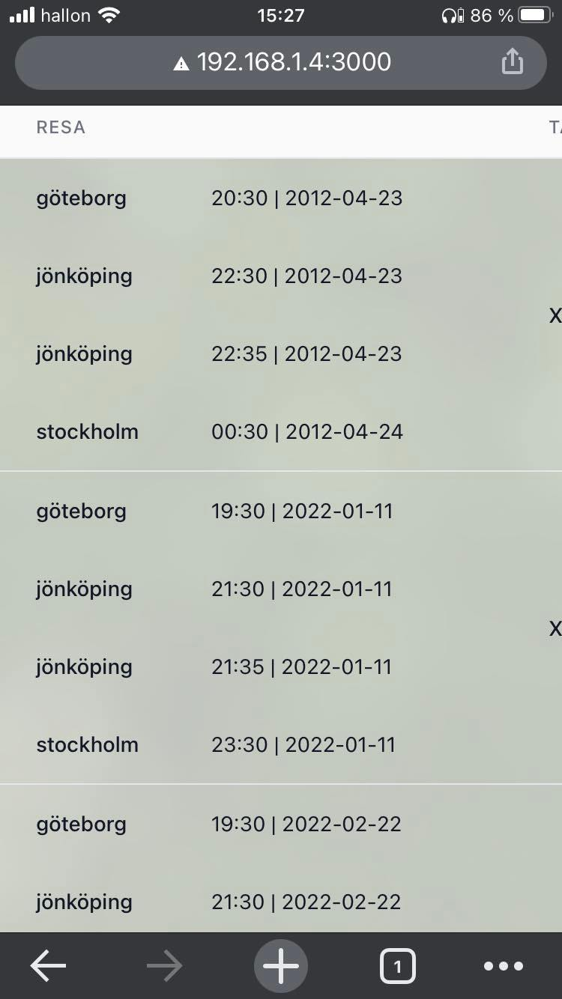

# How to test app in other devices

1) You need to know your local IP-address.
2) You need to turn off firewall in private network or configure it to give vs code permission to receive incoming signals.
3) You need to start the application in VS Code (in two terminals):
   1) cd frontend && npm run start
   2) cd backend && npm run start:dev
4) Now should you be able to browse to the IP-address $(your-local-address):3000

```
http://192.168.1.4:3000 //example
```

